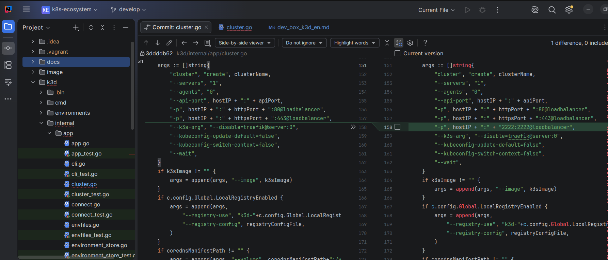

# Dev Box with k3d

This document describes a lightweight local development alternative to the Vagrant-based dev box. Instead of starting a VM, the Kubernetes cluster runs directly in Docker via `k3d`.

Important:
The `k3d` workflow is intended for fast local development and iterative testing.
It cannot cover every scenario that can be tested with the Vagrant-based `k3s` dev box.

Current limitations compared to the Vagrant `k3s` cluster:

- only a single node is used
- storage relies on the default local `k3s` storage class
  - PVC size increases are not supported in this setup
  - backups with Velero are not supported in this setup

## Current scope

The `k3d` workflow is intentionally small. It manages multiple local CES instances with a single CLI:

- `create`
- `start`
- `stop`
- `list`
- `delete`

The CLI creates the local `k3d` cluster, writes a dedicated kubeconfig and then bootstraps CES by calling the existing [`image/scripts/dev/installEcosystem.sh`](../../image/scripts/dev/installEcosystem.sh).
The helper scripts in `image/scripts/dev/` therefore remain the shared installation implementation and are still also used by Vagrant.

## Prerequisites

- `docker`
- `k3d`
- `kubectl`
- `helm`
- `curl`
- `jq`
- `yq`

## One-time configuration

From the repository root:

```shell
cp k3d/config.env.template k3d/config.env
```

Then fill in the credentials in `k3d/config.env`.

Important notes:

- The file contains shared defaults for all local `k3d` ecosystems.
- `k3d` uses a single-node cluster by default.
- Storage uses the default `local-path` storage class that ships with `k3s`.
- Each instance gets:
  - a dedicated loopback IP from `127.0.0.0/24`
  - a dedicated Kubernetes API port starting at `6550`
  - a dedicated kubeconfig in `~/.kube/<fqdn>`
- The cluster-internal CES FQDN is rewritten to `ces-loadbalancer.ecosystem.svc.cluster.local` via a mounted CoreDNS manifest.
- By default, a local registry stack with two endpoints is used:
  - one writable dev registry for `docker push` and `helm push`
  - one proxy registry as a pull-through cache for `registry.cloudogu.com`
  - both share the same storage directory
- `.blueprint-override.yaml` still works because the same blueprint mechanism is used.
- If CES should be updated on repeated bootstrap runs, set `FORCE_UPGRADE_ECOSYSTEM="true"` in `k3d/config.env`.

## Commands

Change into the `k3d` directory:

```shell
cd k3d
```

Show the available commands:

```shell
./ces-k3d --help
```

The public workflow consists of:

```shell
./ces-k3d create my-ces
./ces-k3d list
./ces-k3d start my-ces
./ces-k3d stop my-ces
./ces-k3d delete my-ces
```

## Create a new ecosystem

Create a new local CES instance:

```shell
./ces-k3d create my-ces
```

The CLI assigns these values automatically:

- FQDN: `my-ces.k3ces.localdomain`
- kubeconfig: `~/.kube/my-ces.k3ces.localdomain`
- host IP: next free loopback IP from `127.0.0.0/24`
- Kubernetes API port: next free port starting at `6550`
- default namespace in the kubeconfig context: `ecosystem`

After a successful create, the CLI prints the most relevant follow-up commands, including:

- the URL
- `export KUBECONFIG=...`
- `kubectl cluster-info`
- the `/etc/hosts` command for the CES FQDN
- the local registry endpoints

Example:

```text
Ecosystem 'dev2' is ready.

URL:
  https://dev2.k3ces.localdomain

Dedicated kubeconfig:
  /home/user/.kube/dev2.k3ces.localdomain

Apply kubeconfig:
  export KUBECONFIG=/home/user/.kube/dev2.k3ces.localdomain
  kubectl cluster-info

Add to /etc/hosts if needed:
  sudo sh -c 'echo "127.0.0.3 dev2.k3ces.localdomain" >> /etc/hosts'

Registry stack:
  push:    localhost:5001
  consume: k3d-registry-proxy.localhost:5000
```

## Manage ecosystems

List all managed instances:

```shell
./ces-k3d list
```

The status column reflects the real cluster state:

- `running`
- `stopped`
- `missing`
- `unknown`

Start and stop use the matching `k3d` cluster commands and refresh the dedicated kubeconfig on `start`:

```shell
./ces-k3d stop my-ces
./ces-k3d start my-ces
```

Delete removes:

- the `k3d` cluster
- the dedicated kubeconfig
- the generated instance files under `k3d/environments/`

```shell
./ces-k3d delete my-ces
```

## Registry workflow for local development

The registry stack intentionally exposes two different endpoints:

- host-side push endpoint: `localhost:<LOCAL_REGISTRY_DEV_PORT>`
- cluster-side consumer endpoint: `k3d-<LOCAL_REGISTRY_PROXY_NAME>:<LOCAL_REGISTRY_CLUSTER_PORT>`

This split is intentional:

- local images and OCI charts are pushed to the dev registry
- CES components and local dogu/chart tests consume from the proxy registry
- if an artifact is not available there locally, the proxy registry pulls it from `registry.cloudogu.com`

For the normal workflow, no `/etc/hosts` entries are required for the registries:

- host-side access uses `localhost`
- cluster-side access uses the `k3d-...` container name

## Certificates

The k3d workflow does not install the Vagrant certificates from `.vagrant/certs/`.

This is intentional:

- the Vagrant certificate is issued for `k3ces.localdomain`
- local k3d instances use per-instance FQDNs such as `dev2.k3ces.localdomain`
- reusing the Vagrant certificate would cause SAN mismatches

For k3d, the shared installer is executed in a way that avoids injecting the Vagrant certificate. This allows the CES installation to use the matching self-signed certificate flow for the configured instance FQDN.

## Internal implementation notes

The public wrapper is:

- `k3d/ces-k3d`

It rebuilds the Go binary automatically when Go sources below `k3d/cmd` or `k3d/internal` changed.

## Troubleshooting: Host LDAP, `slapd`, and AppArmor

If the host was prepared for Harbor user creation in the past, `slapd` is often still installed locally.
That daemon typically starts automatically on every boot.

In the `k3d` setup this can cause an LDAP pod to fail during startup with `permission denied`, for example when the startup script runs `slapadd`.

In this case, the cause is a host AppArmor profile for `slapd` at `/etc/apparmor.d/usr.sbin.slapd`.
In nested `k3d` setups, that host profile can affect the container.
At the same time, it may not be possible to bypass it reliably via Kubernetes annotations or an unconfined AppArmor profile entry in the pod.

Workarounds:

- If `slapd` is no longer needed, remove it permanently.
- If `slapd` is still required, temporarily unload the AppArmor profile on the host before starting the local `k3d` environment:

```shell
sudo apparmor_parser -R /etc/apparmor.d/usr.sbin.slapd
```

Then restart the `k3d` cluster or the affected LDAP pod.
After a host reboot or after AppArmor profiles are loaded again, the issue may reappear.


## Exposing Ports in k3d Clusters

If the port is not opened, we would get the error: "Connection refused".

ex: for git clone, we get the following error message:

    ssh: connect to host my-ces.k3ces.localdomain port 2222: Connection refused 
    fatal: Konnte nicht vom Remote-Repository lesen.

### Solution for an existing cluster
  k3d provides a command to inject new port mappings into an existing cluster. 

    k3d cluster edit <cluster-name> --port-add "<port>:<port>@loadbalancer"

  ex: For scm , we have to open up port 2222 to successfully execute git clone (using ssh) .

    k3d cluster edit my-ces --port-add "2222:2222@loadbalancer"

Note:   This process will automatically restart the cluster nodes to apply the new settings.


### Solution for an new cluster
  If required, we can also add additional loadbalancer configurations in cluster.go (method: createFromEnvFile) to ensure we do not have to set it up manually:
  
