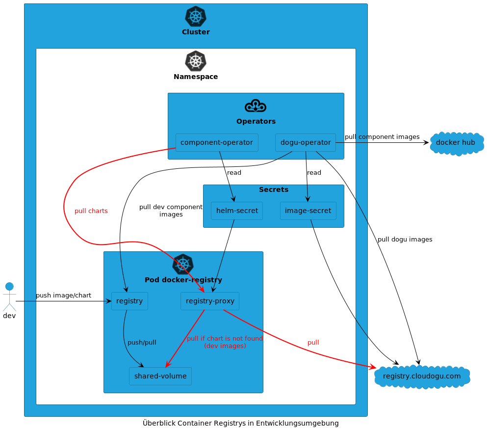

# Registry Proxy für Helm Charts

Im EcoSystem wird über eine Configmap und ein Secret eine zentrale Helm-Registry definiert, die vom Komponenten-Operator verwendet wird.
Bei der Entwicklung muss die Konfiguration auf die im Cluster befindliche Registry zeigen, um Helm-Charts dort zu testen.
Allerdings lässt der Operator dann nicht mehr zu Komponenten zu installieren, die man gerade nicht entwickelt.
Um einen ständigen Wechsel von der offiziellen und der Dev-Registry zu vermeiden, wird eine zweite Dev-Registry betrieben.
Die zweite Registry wird als Proxy zur offiziellen `registry.cloudogu.com` konfiguriert.
Dabei kann sie allerdings nur Images liefern und keine Push-Operationen annehmen.
Docker Images und Helm-Charts werden wie gewohnt in die reguläre Dev-Registry gepusht.
Weil die beiden Registry sich ein Volume teilen können gepushte Artefakte während der Entwicklung von der Proxy-Registry bezogen werden.

Siehe [Docker-Registry](https://docs.docker.com/registry/recipes/mirror/)
