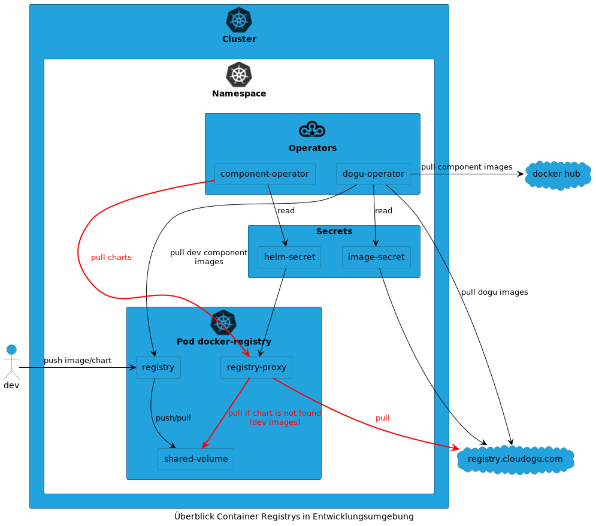

# Registry Proxy for Helm Charts

## Overview

In the EcoSystem, a central Helm registry is defined via a configmap and a secret, which is used by the component operator.
During development, the configuration must point to the registry located in the cluster in order to test Helm charts there.
However, the operator then no longer allows components to be installed that are not currently being developed.
A second dev registry is operated to avoid constant switching between the official and dev registry.
The second registry is configured as a proxy to the official `registry.cloudogu.com`.
However, it can only deliver images and cannot accept push operations.
Docker images and Helm charts are pushed to the regular dev registry as usual.
Because the two registries share a volume, pushed artifacts can be obtained from the proxy registry during development.

See [Docker Registry](https://docs.docker.com/registry/recipes/mirror/)

## Deleting unused images

To free up storage space, you can delete unused images on the nodes.

### Delete unused images on each individual node:
- Connect to the node via `vagrant ssh NODENAME`, e.g. `vagrant ssh worker-0`
- Delete unused images via `sudo k3s crictl rmi --prune`.

### Delete all images of the Docker registry
- Killing the `docker-registry-...` pod deletes all images, e.g. via [Ctrl]+[k] in k9s