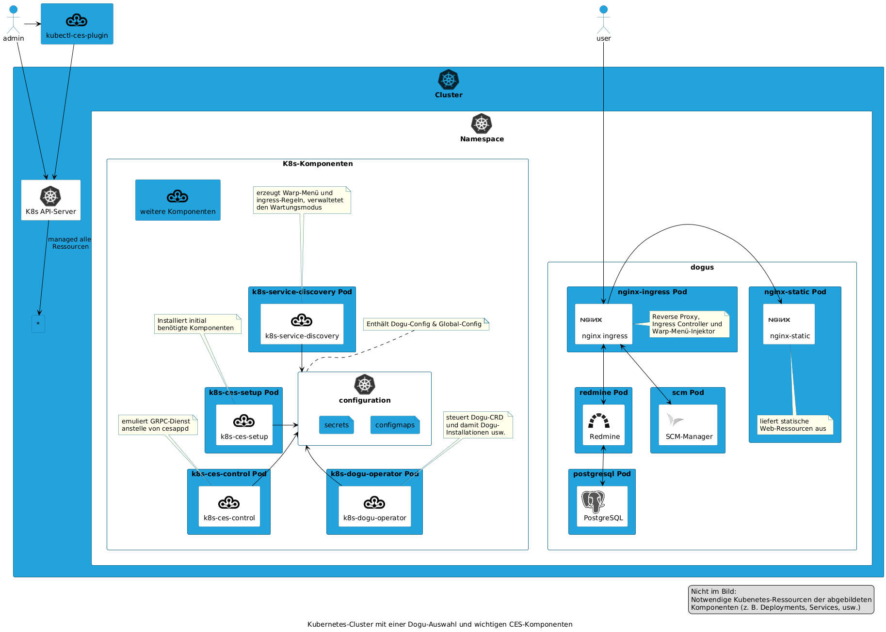

# Cloudogu EcoSystem in einem Kubernetes Cluster

Bei der Entwicklung der Multi-Node-Variante des Cloudogu EcoSystems sorgt Cloudogu grundsätzlich für eine Rückwärtskompatibilität bzgl. der Kundendaten. Das bedeutet, der überwiegende Teil von Dogus und deren Daten ist genauso lauffähig wie in einem [Single-Node Cloudogu EcoSystem](https://github.com/cloudogu/ecosystem).

Da sich beide Plattformen insbesondere hinsichtlich ihrer technischen Umsetzung unterscheiden, ist es natürlich, dass die gewohnten Funktionalitäten in Kubernetes mit plattformspezifischen Mitteln umgesetzt werden. Dieses Dokument beschreibt Ähnlichkeiten und Besonderheiten zwischen Multi-Node Cloudogu EcoSystems und der Single-Node Variante. 

## Ähnlichkeiten

Die Single- und Multi-Node-Varianten des Cloudogu EcoSystems teilen sich diese strukturellen Funktionalitäten:

- Dogu-Applikationen werden als Docker-Container ausgeführt
- [`dogu.json`](https://github.com/cloudogu/dogu-development-docs/blob/main/docs/core/compendium_en.md) beschreibt nötige Abhängigkeiten und den inneren Aufbau einer Dogu-Applikation
- Der grundsätzliche Zugang zur lokalen EcoSystem-Registry als auch deren inhaltlicher Aufbau ändert sich nicht
- Das Setup ermöglicht eine "unattended" Installation mittels [`setup.json`](https://docs.cloudogu.com/de/docs/system-components/ces-setup/operations/setup-json/)

## Übersicht über Kubernetes-spezifische Komponenten 

Die folgenden Kubernetes-Komponenten kommen im Kubernetes Cloudogu EcoSystem zum Einsatz:

- [k8s-ces-setup](https://github.com/cloudogu/k8s-ces-setup)
  - die Kubernetes-spezifische Variante von `ces-setup` sorgt für eine Grundinstallation eines Cloudogu EcoSystem mittels der hier genannten Komponenten
- [k8s-dogu-operator](https://github.com/cloudogu/k8s-dogu-operator)
  - verwaltet Dogus hinsichtlich ihrer Installation, Aktualisierung, Deinstallation und einiges mehr  
- [k8s-service-discovery](https://github.com/cloudogu/k8s-service-discovery)
  - verwaltet Dogus hinsichtlich ihrer Erreichbarkeit im Warp-Menü und der Cloudogu EcoSystem Registry
  - verwaltet TLS-Zertifikate des Cloudogu EcoSystem
- [k8s-component-operator](https://github.com/cloudogu/k8s-component-operator)
  - verwaltet K8s-CES-Komponenten hinsichtlich ihrer Installation, Aktualisierung und Deinstallation
- [k8s-etcd](https://github.com/cloudogu/k8s-etcd)
  - stellt die lokale Cloudogu EcoSystem Registry zur Verfügung
- [k8s-ces-control](https://github.com/cloudogu/k8s-ces-control)
  - ermöglicht geschützten Zugang zu Administrationsvorgängen mit dem Admin-Dogu
- [k8s-host-change](https://github.com/cloudogu/k8s-host-change)
  - regelt eine geordnete Änderung von FQDN oder öffentlicher IP-Adresse des Clusters
- [k8s-longhorn](https://github.com/cloudogu/k8s-longhorn)
  - stellt eine Node-übergreifende Storage-Replikation allen Dogus mit Zustand zur Verfügung

Umgekehrt heißt dies, dass diese Komponenten nicht im Single-Node Cloudogu EcoSystem eingesetzt werden können (vgl. Kapitel "Betriebssystempakete")

## Setup-Prozess in einem Kubernetes Cluster

Wegen der Eigenheiten von Kubernetes unterscheidet sich der Setup-Prozess von dem des Single-Node EcoSystem. Zusammenfassed wird sehr Ressourcen-orientiert gearbeitet und einige Dinge müssen von den Administrierenden manuell ausgebracht werden. Die Dokumentation von [`k8s-ces-setup` beschreibt](https://github.com/cloudogu/k8s-ces-setup/blob/develop/docs/operations/installation_guide_de.md) dies genauer. 

Das folgende Diagramm veranschaulicht den Prozess und beteiligte Komponenten:

## Installation von Dogus in einem Kubernetes Cluster

Vor dem Hintergrund von Kubernetes ändert sich nicht nur der Setup-Prozess. Die meisten der internen Prozesse unterliegen deutlichen Änderungen im Vergleich zum Single-Node EcoSystem. Der Dogu-Client `cesapp` lässt sich daher nicht mehr mit Kubernetes zusammenbringen. An dessen Stelle steht nun der `k8s-dogu-operator`. 

Den Prozess zu einer Dogu-Installation mit dessen beteiligten Komponenten veranschaulicht das folgende Diagramm:

## Übersicht über Dogu-spezifische Besonderheiten in Kubernetes

Diese Kubernetes-spezifischen Dogus kommen im Kubernetes Cloudogu EcoSystem zum Einsatz:

- [k8s/nginx-ingress](https://github.com/cloudogu/nginx-ingress)
- [k8s/nginx-static](https://github.com/cloudogu/nginx-static)

Grundsätzlich funktionieren alle Dogus in einem Cloudogu EcoSystem in Kubernetes wie in der Single-Node Variante. Die folgenden Ausnahmen existieren jedoch.

Das Dogu `official/nginx` wird in einer Kubernetes-Umgebung durch zwei Dogus und eine Komponente ersetzt: `k8s/nginx-ingress` und `k8s/nginx-static`. Der Grund hierfür liegt darin, dass in Kubernetes mehrere Dinge gleichzeitig geleistet werden, die sich auf diese Art in Kubernetes nicht fortführen lassen. Hinzu kommt noch die Tätigkeit eines [Ingress-Controllers](https://kubernetes.io/docs/concepts/services-networking/ingress-controllers/), der in einer reinen Docker-Welt keine Entsprechung findet.

Die folgende Tabelle vergleicht die Funktionalitäten und jeweils abbildenden Komponenten/Dogus:

| Thema                   | K8s-CES               | herkömmliches CES                                 |
|-------------------------|-----------------------|---------------------------------------------------|
| Reverse Proxy           | k8s/nginx-ingress     | official/nginx                                    |
| Ingress Controller      | k8s/nginx-ingress     | -/-                                               |
| HTTP Response Injection | k8s/nginx-ingress     | official/nginx                                    |
| Static Content Hosting  | k8s/nginx-static      | official/nginx                                    |
| Warp-Menü erzeugen      | k8s-service-discovery | official/nginx + official/registrator + ces-confd |
| TLS-Termination         | k8s/nginx-ingress     | official/nginx                                    |

## Betriebssystempakete

Die Single-Node-Variante des Cloudogu EcoSystems basiert auf einer _Virtuellen Maschine_, sodass dort Funktionserweiterungen mittels eigener Systempakete erfolgt. Bekannte Beispiele sind hier `cesapp` oder `ces-setup`, die über den Debian-Paket-Mechanismus aktualisiert werden können.

Die Multi-Node-Variante des Cloudogu EcoSystems hingegen basiert auf _Kubernetes Clustern_. Dieser Umstand erschwert die generelle Möglichkeit, Betriebssystempakete auf den einzelnen Kubernetes-Nodes einzusetzen, da jeder Cluster unterschiedlich aufgebaut sein könnte.

Daher ist es **nicht vorgesehen**, Cloudogu-Betriebssystempakete auf ein Kubernetes Cloudogu EcoSystem anzuwenden. Dies betrifft insbesondere den Abschnitt `packages` des [Blueprint-Mechanismus](https://docs.cloudogu.com/de/docs/system-components/cesapp/operations/blueprint_upgrade/#property-packages) zu.

 