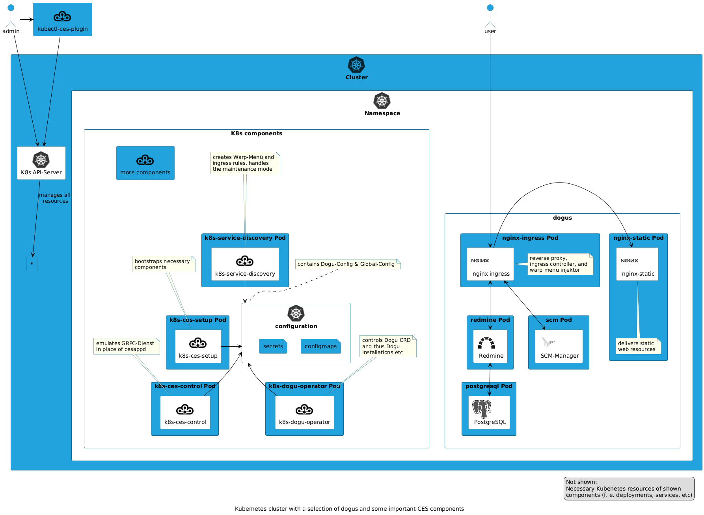

# Cloudogu EcoSystem in a Kubernetes cluster.

When developing the multi-node variant of the Cloudogu EcoSystem, Cloudogu basically ensures backwards compatibility with regard to customer data. This means that the majority of Dogus and its data can be run in the same way as in a [single-node Cloudogu EcoSystem](https://github.com/cloudogu/ecosystem).

Since both platforms differ, especially in terms of their technical implementation, this means that the same functionalities in Kubernetes are implemented using platform-specific means. This document describes similarities and peculiarities between multi-node Cloudogu EcoSystems and the single-node variant.

## Similarities

The single- and multi-node variants of Cloudogu EcoSystems share these structural functionalities:

- Dogu applications run as Docker containers
- [`dogu.json`](https://github.com/cloudogu/dogu-development-docs/blob/main/docs/core/compendium_en.md) describes necessary dependencies and the inner structure of a Dogu application
- The basic access to the local EcoSystem registry as well as its content structure does not change
- The setup allows an "unattended" installation using [`setup.json`](https://docs.cloudogu.com/de/docs/system-components/ces-setup/operations/setup-json/)

## Overview of Kubernetes-specific components

The following Kubernetes components are used in the Kubernetes Cloudogu EcoSystem:

- [k8s-ces-setup](https://github.com/cloudogu/k8s-ces-setup)
  - the Kubernetes-specific variant of `ces-setup` provides a basic installation of a Cloudogu EcoSystem using the components mentioned here
- [k8s-dogu-operator](https://github.com/cloudogu/k8s-dogu-operator)
  - manages Dogus in terms of their installation, updating, uninstallation and some more
- [k8s-service-discovery](https://github.com/cloudogu/k8s-service-discovery)
  - manages Dogus in terms of their accessibility in the Warp menu and the Cloudogu EcoSystem Registry
  - manages TLS certificates of the Cloudogu EcoSystem
- [k8s-component-operator](https://github.com/cloudogu/k8s-component-operator)
  - manages K8s CES components in terms of their installation, update and uninstallation.
- [k8s-etcd](https://github.com/cloudogu/k8s-etcd)
  - provides the local Cloudogu EcoSystem Registry
- [k8s-ces-control](https://github.com/cloudogu/k8s-ces-control)
  - provides protected access to administration operations with the Admin-Dogu
- [k8s-host-change](https://github.com/cloudogu/k8s-host-change)
  - controls an orderly change of FQDN or public IP address of the cluster
- [k8s-longhorn](https://github.com/cloudogu/k8s-longhorn)
  - provides cross-node storage replication to all dogus with state

.

Conversely, this means that these components cannot be used in the single-node Cloudogu EcoSystem (see the "Operating System Packages" chapter).

## Setup process in a Kubernetes cluster.

Due to the peculiarities of Kubernetes, the setup process differs from that of the single-node EcoSystem. In summary, it is very resource-oriented and some things have to be deployed manually by the administrators. The documentation of [`k8s-ces-setup` describes](https://github.com/cloudogu/k8s-ces-setup/blob/develop/docs/operations/installation_guide_en.md) this in more detail.

The following diagram illustrates the process and involved components:

## Installing Dogus in a Kubernetes cluster.

Against the backdrop of Kubernetes, not only the setup process changes. Most of the internal processes are subject to significant changes compared to the single-node EcoSystem. Therefore, the Dogu client `cesapp` can no longer be merged with Kubernetes. In its place is now the `k8s-dogu-operator`.

The process to a Dogu installation with its involved components is illustrated in the following diagram:

## Overview of dogu-specific features in Kubernetes.

These Kubernetes-specific dogus are used in the Kubernetes Cloudogu EcoSystem:

- [k8s/nginx-ingress](https://github.com/cloudogu/nginx-ingress)
- [k8s/nginx-static](https://github.com/cloudogu/nginx-static)

In principle, all Dogus in a Cloudogu EcoSystem function in Kubernetes as they do in the single-node variant. However, the following exceptions exist.

The dogu `official/nginx` is replaced by two dogus and one component in a Kubernetes environment: `k8s/nginx-ingress` and `k8s/nginx-static`. The reason for this is that several things are done simultaneously in Kubernetes that cannot be continued in this way in Kubernetes. In addition, there is the activity of an [ingress-controller](https://kubernetes.io/docs/concepts/services-networking/ingress-controllers/), which has no equivalent in a Docker-only world.

The following table compares the functionalities and respective mapping components/dogus:

| theme                   | K8s-CES               | conventional CES                                  |
|-------------------------|-----------------------|---------------------------------------------------|
| reverse proxy           | k8s/nginx-ingress     | official/nginx                                    |
| Ingress Controller      | k8s/nginx-ingress     | -/-                                               |
| HTTP Response Injection | k8s/nginx-ingress     | official/nginx                                    |
| Static Content Hosting  | k8s/nginx-static      | official/nginx                                    |
| Create Warp Menu        | k8s-service-discovery | official/nginx + official/registrator + ces-confd |
| TLS-termination         | k8s/nginx-ingress     | official/nginx                                    |

## Operating system packages

The single-node variant of the Cloudogu EcoSystem is based on a _virtual machine_, so that function extensions are made there by means of own system packages. Well-known examples here are `cesapp` or `ces-setup`, which can be updated via the Debian package mechanism.

The multi-node variant of the Cloudogu EcoSystem, on the other hand, is based on _Kubernetes clusters_. This circumstance complicates the general possibility of deploying OS packages on the individual Kubernetes nodes, as each cluster could be built differently.

Therefore, it is **not intended** to apply Cloudogu operating system packages to a Kubernetes Cloudogu EcoSystem. In particular, this applies to the `packages` section of the [Blueprint Mechanism](https://docs.cloudogu.com/de/docs/system-components/cesapp/operations/blueprint_upgrade/#property-packages) to.